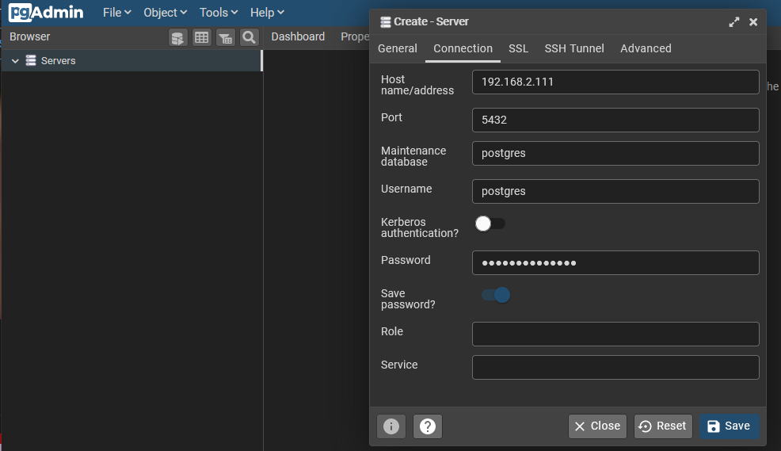
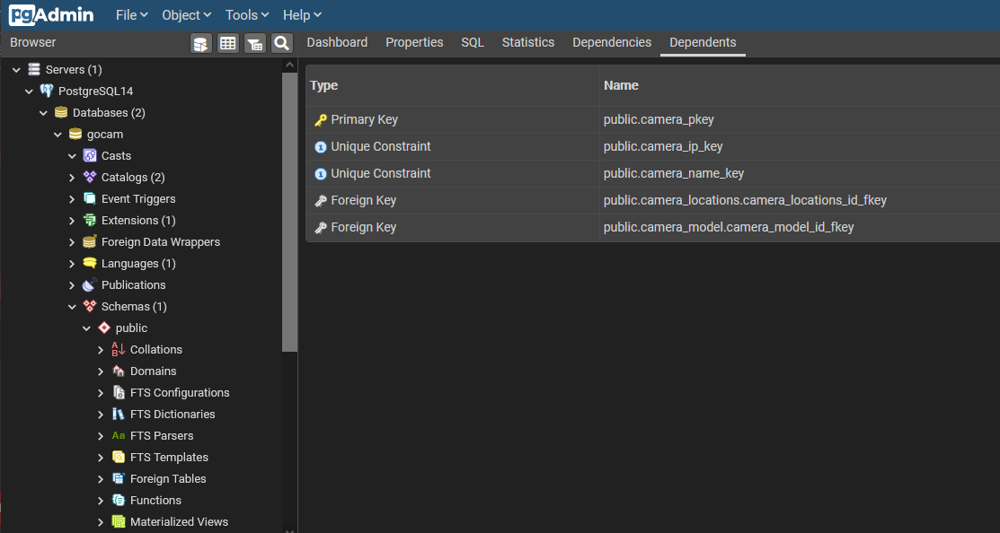

# Postgres with Go

<!-- TOC -->

- [PostgreSQL v14 Setup](#postgresql-v14-setup)
- [Create a Database and Tables](#create-a-database-and-tables)
- [Setting up pgadmin (optional)](#setting-up-pgadmin-optional)
- [Let's Go](#lets-go)
  - [Operations](#operations)
    - [Adding New Data](#adding-new-data)
    - [Updating Data](#updating-data)
    - [Deleting Data](#deleting-data)
    - [Reading Data](#reading-data)

<!-- /TOC -->

## PostgreSQL v14 Setup

```bash
docker run -d --rm \
    --name postgres \
    -e POSTGRES_PASSWORD=secretpassword \
    -p 5432:5432 \
    postgres:14
```

```bash
docker exec -ti -u postgres postgres psql

psql (14.0 (Debian 14.0-1.pgdg110+1))
Type "help" for help.

postgres=#
```

## Create a Database and Tables

```sql
CREATE DATABASE gocam;
```

```sql
\c gocam;

You are now connected to database "gocam" as user "postgres".
```

```sql
CREATE TABLE alarm_rec (camera_id INT, rec_path VARCHAR(100), created_at TIMESTAMP NOT NULL DEFAULT NOW());
```

## Setting up pgadmin (optional)

> Make sure that your database is accessible via the external IP address of your server, e.g. `ufw allow 5432/tcp` !

```bash
docker pull dpage/pgadmin4:latest
```

```bash
docker run -p 8080:80 \
    --name pgadmin \
    -e 'PGADMIN_DEFAULT_EMAIL=user@domain.com' \
    -e 'PGADMIN_DEFAULT_PASSWORD=secretpassword' \
    -d dpage/pgadmin4:latest
```

Login with the default email and password and open the dashboard on port `8080`. Select to add your Postgres Server:






## Let's Go

```bash
go mod init github.com/mpolinowski/go-postgres
go get github.com/lib/pq
```

```go
package main

import (
    "database/sql"
    "fmt"
	"time"
    _ "github.com/lib/pq"
)

const (
    host     = "192.168.2.111"
    port     = 5432
    user     = "postgres"
    password = "secretpassword"
    database = "gocam"
)

func main() {
    // Build the database connection string
    psqlconn := fmt.Sprintf("host=%s port=%d user=%s password=%s database=%s sslmode=disable", host, port, user, password, database)

    // Connect to database using the sql package
    db, err := sql.Open("postgres", psqlconn)
    CheckError(err)

    // Make sure connection is closed when done
    defer db.Close()

    // Verify you are connected and log result
    err = db.Ping()
    CheckError(err)
    fmt.Println(time.Now().Format(time.RFC850), ":: Connected to database")
}

func CheckError(err error) {
    if err != nil {
        panic(err)
    }
}
```

Test run with `go run ./src/sql/main.go`:

```bash
go run ./src/sql/main.go
Saturday, 16-Oct-21 17:36:36 CST :: Connected to database
```

### Operations

#### Adding New Data

Adding data to our `alarm_rec` table:

```go
// Insert static data
insertData := `INSERT INTO "alarm_rec"("camera_id", "rec_path") VALUES('0001', '/opt/rec/12332423dsfsd232.snap')`
_, e := db.Exec(insertData)
CheckError(e)

// Insert dynamic data
camID := 0002
recPath := "/opt/rec/546sdgv2314sdfgd232.snap"
insertVarData := `INSERT INTO "alarm_rec"("camera_id", "rec_path") VALUES($1, $2)`
_, e = db.Exec(insertVarData, camID, recPath)
CheckError(e)
```


#### Updating Data

```go
// Update a row
updateData := `UPDATE "alarm_rec" SET "rec_path"=$1 WHERE "camera_id"=$2`
_, e := db.Exec(updateData, "/opt/rec/false_positive/546sdgv2314sdfgd232.snap", 0001)
CheckError(e)
```

#### Deleting Data

```go
// Delete a row
deleteData := `DELETE FROM "alarm_rec" WHERE "camera_id"=$1`
_, e := db.Exec(deleteData, 0001)
CheckError(e)
```

#### Reading Data

```go
selectData := `SELECT "rec_path" FROM "alarm_rec" WHERE "camera_id"=$1`
	rows, err := db.Query(selectData, 0002)
	CheckError(err)
	defer rows.Close()
	for rows.Next() {
		var path string

		err = rows.Scan(&path)
		CheckError(err)

		fmt.Println(path)
	}
	CheckError(err)
```

```bash
go run ./src/sql/main.go
Saturday, 16-Oct-21 18:50:33 CST :: Connected to database
/opt/rec/546sdgv2314sdfgd232.snap
```
